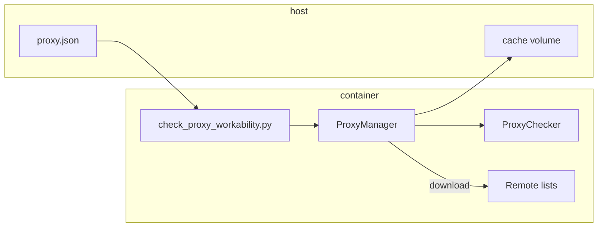

# Container workability testing plan

This document describes how to run MegaTool **proxy workability** checks (download + `ProxyChecker` verification + cache) inside a reproducible container environment.

## Scope

| In scope | Out of scope |
|----------|----------------|
| HTTP / SOCKS4 / SOCKS5 proxy download from `proxy.json` | Layer 4 / Layer 7 attack runs |
| `ProxyChecker.checkAll` against a probe URL | SYN flood (requires host `CAP_NET_RAW`) |
| 24h cache at `cache/proxies.json` | Interactive `start` / `stop` console |

Workability logic lives in `ProxyManager.get_proxies()` in `megatool.py`; the container entrypoint calls it via `scripts/check_proxy_workability.py`.

## Architecture



## Components

| Artifact | Role |
|----------|------|
| `scripts/check_proxy_workability.py` | CLI: `--dry-run`, `--smoke`, `--force`, `--check-url` |
| `scripts/container-smoke.sh` | Local: build image + run dry-run and smoke in container |
| `Dockerfile` | Python 3.11 slim image, non-root user, default `--dry-run` |
| `docker-compose.yml` | Mounts `proxy.json` + `cache/`; `proxy-workability-force` bypasses cache |
| `.github/workflows/proxy-workability.yml` | CI: build image + dry-run smoke test |

## Usage

### Local (no container)

```bash
pip install -r requirements.txt
python scripts/check_proxy_workability.py --dry-run   # proxy.json only
python scripts/check_proxy_workability.py --smoke    # imports + config.json + AttackManager
./scripts/container-smoke.sh                         # build image + both checks in Docker
python scripts/check_proxy_workability.py --check-url http://httpbin.org/get  # needs live proxies
python scripts/check_proxy_workability.py --force
```

Exit codes: `0` success, `1` no working proxies, `2` config error.

### Container build and run

```bash
docker build -t megatool-proxy-workability .
docker run --rm megatool-proxy-workability
docker run --rm -v "$(pwd)/cache:/app/cache" -v "$(pwd)/proxy.json:/app/proxy.json:ro" \
  megatool-proxy-workability --check-url http://httpbin.org/get
```

### Docker Compose

```bash
# Config validation only (no outbound network required)
docker compose run --rm proxy-workability --dry-run

# Full check; uses CHECK_URL (default http://httpbin.org/get)
docker compose run --rm proxy-workability

# Ignore cache and re-verify
docker compose run --rm proxy-workability-force
```

## CI strategy

| Check | When | What it proves |
|-------|------|----------------|
| `--dry-run` | Every PR / push to `main` | `proxy.json` parses; image starts |
| `--smoke` | Every PR / push to `main` | PyRoxy, impacket, `megatool` import; `config.json` valid; `AttackManager` constructs |
| Full workability | Manual / scheduled (optional) | Live proxy download + `ProxyChecker`; needs real URLs in `proxy.json` |

Regular automated smoke is enough for day-to-day development. A full proxy check is only needed when you change provider URLs or checker behavior.

## Operational notes

- **PyRoxy install:** `requirements.txt` pulls MatrixTM/PyRoxy from a GitHub zip archive (no `git` binary required in the image).
- **Network:** Full checks need egress to provider URLs and the `--check-url` host (default `httpbin.org`).
- **Cache:** Bind-mount `./cache` so repeated runs reuse `proxies.json` for 24 hours unless `--force` is used.
- **Secrets:** Do not bake credentials into the image; mount `proxy.json` at runtime if sources differ per environment.
- **Root:** Image runs as UID 1000; sufficient for proxy checks. SYN/L4 testing is not supported in this image.

## Success criteria

- Dry-run completes with exit `0` in CI.
- Full run reports `N working proxy(ies)` and writes `cache/proxies.json` when at least one provider returns live proxies.
- `--force` deletes stale cache and re-runs download + checker.
